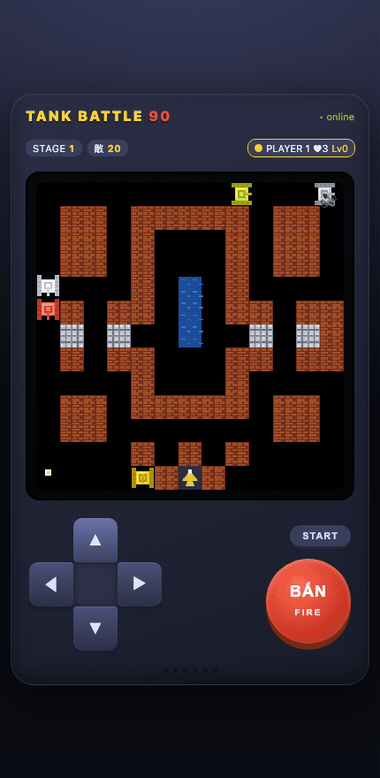
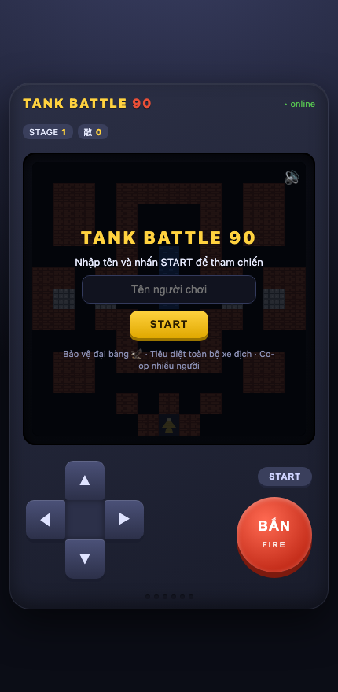
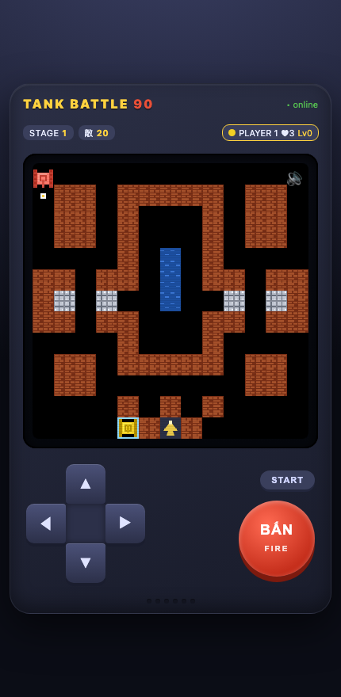

<div align="center">

# 🕹️ TANK BATTLE 90

**Game bắn xe tăng co-op realtime nhiều người — chơi trên trình duyệt & điện thoại**
Giao diện "máy điện tử băng" cổ điển · lấy cảm hứng từ Battle City / Tank 1990

[](LICENSE)


### [▶ Chơi Demo ngay trên trình duyệt](https://phanngoc.github.io/tank-battle-90/demo.html) · [🌐 Trang giới thiệu](https://phanngoc.github.io/tank-battle-90/)



</div>

---

## ✨ Tính năng
- 🎮 **Giao diện máy điện tử băng**: màn hình LCD (có scanline) ở trên, D-pad + nút BẮN cỡ lớn ở dưới — tối ưu cảm ứng.
- 🌐 **Co-op realtime tới 4 người** qua WebSocket; server giữ trạng thái chuẩn (*authoritative*).
- 🦅 **Bảo vệ đại bàng**, diệt 20 xe địch/màn qua 3 màn địa hình khác nhau.
- ⭐ **6 vật phẩm**, 🤖 **4 loại xe địch**, 🧱 địa hình gạch/thép/nước/cây.
- 🕹️ **Demo 1 người chơi ngay trên GitHub Pages** — chạy engine client-side, không cần server.

## 🚀 Chạy bản co-op (nhiều người, cùng Wi-Fi)

```bash
git clone https://github.com/phanngoc/tank-battle-90.git
cd tank-battle-90
npm install      # chỉ lần đầu (cài 'ws')
npm start        # hoặc: node server.js
```

Server in ra URL:
- Trên máy này: `http://localhost:3000`
- Trên điện thoại (cùng Wi-Fi): `http://<IP-LAN>:3000`

Mở URL trên **nhiều thiết bị** → tất cả vào chung một trận co-op.

## 🎯 Điều khiển
| | Di chuyển | Bắn | Vào trận / Chơi lại |
|---|---|---|---|
| **Điện thoại** | D-pad | nút **BẮN** (giữ = bắn liên tục) | **START** |
| **Máy tính** | mũi tên / **WASD** | **Space / Enter** | **START** |

## 📜 Luật chơi
- Tiêu diệt toàn bộ **20 xe địch** mỗi màn để qua màn.
- **Bảo vệ đại bàng 🦅** ở căn cứ (giữa dưới). Đại bàng bị bắn = thua ngay.
- Mỗi người **3 mạng**. Hết mạng của tất cả HOẶC đại bàng bị phá = Game Over.
- Gạch vỡ được; **thép** chỉ phá khi lên sao tối đa; **nước** chặn xe (đạn bay qua); **cây** che khuất xe.

## 🎁 Vật phẩm (bắn xe địch **nhấp nháy** để rơi ra)
| Vật phẩm | Hiệu ứng |
|----------|----------|
| ⭐ Ngôi sao | Nâng cấp sức mạnh (đạn nhanh → 2 viên → phá được thép) |
| ⏰ Đồng hồ | Đóng băng toàn bộ địch ~8 giây |
| ⛏️ Xẻng | Tường quanh căn cứ hoá thép ~15 giây |
| 💣 Lựu đạn | Tiêu diệt tất cả địch đang trên bản đồ |
| 🛡️ Mũ giáp | Khiên bất tử tạm thời ~10 giây |
| 🚗 Xe tăng | +1 mạng cho người nhặt |

## 🤖 Loại xe địch
**Basic** (xám) · **Fast** (xanh, đi nhanh) · **Power** (đỏ, bắn nhanh) · **Armor** (đổi màu, chịu 4 phát). Xe **nhấp nháy hồng** mang vật phẩm.

## 📸 Ảnh chụp
| Màn hình bắt đầu | Trong trận |
|---|---|
|  |  |

## 🏗️ Kiến trúc
| File | Vai trò |
|------|---------|
| `server.js` | HTTP tĩnh + WebSocket + game loop 30Hz (server-authoritative) |
| `game.js` | Engine mô phỏng: bản đồ, va chạm, AI địch, đạn, vật phẩm, điểm — chạy được cả Node lẫn browser |
| `public/` | Client online (canvas render + gửi input) & giao diện máy cầm tay |
| `docs/` | GitHub Pages: trang giới thiệu + **demo 1 người chơi client-side** |

Server là *authoritative*: client chỉ gửi input (hướng + bắn) và vẽ lại state nhận được → đồng bộ nhiều người & chống gian lận cơ bản.

## 📄 License
[MIT](LICENSE) © phanngoc · Đồ hoạ & code **nguyên bản**; gameplay lấy cảm hứng từ dòng game bắn tăng 2D cổ điển.
